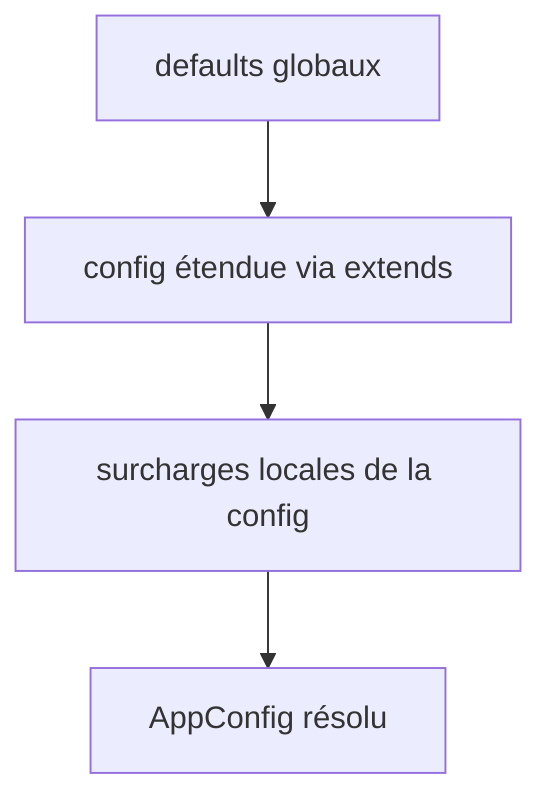

# Design — Migration Configuration INI → YAML + Pydantic

**Date** : 2026-08-05
**Statut** : Validé par l'utilisateur (brainstorming)
**Décisions clés** : YAML (pas TOML), migration directe sans back-compat (ProFiles non publié), round-trip via `ruamel.yaml`, modèles Pydantic.

---

## 🎯 Objectif

Remplacer le format de configuration INI (`.profiles`, `configparser`) par un format **YAML** (`.profiles.yaml`) avec :
- **Plus de niveaux d'imbrication** que l'INI plat
- **Types riches** (listes, objets) au lieu des CSV strings
- **Héritage** entre configurations (`defaults` globaux + blocs nommés avec `extends`)
- **Validation** avec erreurs claires et chemin YAML précis
- **Round-trip** : le GUI continue d'écrire dans le fichier en préservant commentaires/formatage

**Choix de format** : YAML (plutôt que TOML) — formatage plus propre pour les configurations répétées (Array of Tables TOML jugé étrange). **Aucun convertisseur, aucune back-compat** : ProFiles n'est pas encore publié.

---

## 📄 Schéma YAML (`.profiles.yaml`)

```yaml
# .profiles.yaml
version: 1

defaults:
  title: ""
  gui_auto_launch: true
  close_after_execute: false
  theme: light            # "light" | "dark"
  language: en            # "en" | "fr"
  search_dir: "{cwd}"
  recursive_search: false
  extensions: [All, .lnk]
  filters: ["", ST_PRO, ST_ENG]
  row_colors:
    - pattern: TMP
      color: "#BAC015"
    - pattern: DEV
      color: "#C01565"
  search_exclude_dirs: [.git, .*, __pycache__, bin, obj, tmp, Obsolete, Debug]
  search_exclude_files: []
  verbose: INFO            # DEBUG | INFO | WARNING | ERROR | CRITICAL
  scan_metrics: false
  launch_hook_failmode: warn
  launch_hook_timeout: 30

columns:
  File:
    width: 600
    expression: ".*"
    group: 0
    priority: 100
    default: ""
  Path:
    width: 200
    expression: "(.+[\\\\/])"
    group: 1
    priority: 40
    default: "."
  FileName:
    width: 150
    expression: "([^/\\\\]+)$"
    group: 1
    priority: 30
  Type:
    width: 80
    expression: "(PRO|ENG|DEV|TMP|DEBUG)(?!.*(?:PRO|ENG|DEV|TMP|DEBUG))"
    group: 1
    priority: 20
  Version:
    width: 100
    expression: "[-_]V(\\d+(?:\\.\\d+)*)(?=[^\\\\/]*\\.[a-zA-Z0-9]+$)"
    group: 1
    priority: 10

hooks:
  failmode: warn
  timeout: 30
  entries:
    ".mttl":
      - when: before
        command: "logger.exe --file {{path}}"
      - when: after
        command: "notifier.exe --name {{name}}"
    ".pdf":
      - command: "SumatraPDF.exe -reuse-instance {{path}}"

configs:
  base:
    pc_name: Generic
    directory: "{cwd}"
    row_colors:
      - pattern: SPECIFIC
        color: "#FF0000"

  production:
    extends: base
    pc_hostname: COMPUTER-1
    pc_ip: 172.16.40.143
    extensions: [.pdf, .docx, .lnk, .xlsx]
    filters: [tmp, dev, prod]
```

### Règles du schéma

- **`defaults:`** — niveau global, hérité par toutes les configs. Optionnel ; s'il est absent, des valeurs par défaut codées en dur sont utilisées.
- **`configs:`** — map nommée (remplace `[CONFIGURATION_N]`). Chaque bloc peut avoir `extends: <nom>`.
- **`columns:`** — map nommée (remplace `[COLUMN_*]`), **ordre préservé** (dict ordonné). La colonne `File` reste implicite en première position.
- **`hooks.entries`** — map extension → liste d'objets `{when, command, requires_success}`. `when` optionnel (défaut `before`).
- **`row_colors`** — liste d'objets `{pattern, color}` au lieu de CSV strings.
- **`version: 1`** — pour gérer les futures migrations de schéma.
- **Booleans français supprimés** : uniquement `true`/`false` YAML standard.

---

## 🏗️ Architecture

### Nouvelle structure du package `src/profiles/core/config/`

```
src/profiles/core/config/
├── __init__.py          # Exports publics (surface publique préservée)
├── loader.py            # Point d'entrée : trouve + charge .profiles.yaml
├── reader.py            # ConfigReader → YAML → validation → héritage → AppConfig
├── models.py            # RÉÉCRIT : dataclasses → modèles Pydantic
├── service.py           # Opérations domaine (INCHANGÉ conceptuellement)
├── template.py          # RÉÉCRIT : STARTER_CONFIG_TEMPLATE → string YAML
├── validator.py         # 🆕 Validation sémantique + chemins d'erreur précis
├── inheritance.py       # 🆕 Résolution extends + fusion defaults (fonctions pures)
└── io/
    ├── __init__.py
    └── yaml_io.py       # 🆕 Lecture/écriture round-trip (ruamel.yaml)
```

**Fichiers supprimés** : `io/ini_primitives.py`, `io/writer.py`.

### Flux de données


### Responsabilités (SRP)

| Module | Responsabilité |
|--------|----------------|
| `yaml_io.py` | Lecture/écriture brute du YAML via `ruamel.yaml` (round-trip, préservation commentaires/ordre/formatage). Pas de connaissance du domaine. |
| `validator.py` | Valide l'arbre YAML brut (sémantique au-delà des types Pydantic) : `extends` existant, pas de cycle, clés inconnues. Produit des `ConfigError` avec chemin YAML précis. |
| `inheritance.py` | Résout `extends` + fusionne `defaults` et les surcharges locales. Fonctions pures. |
| `models.py` | Modèles Pydantic : types, contraintes, `Literal` pour les enums. |
| `reader.py` | Orchestre : YAML brut → validation → héritage → `AppConfig` résolu. |
| `service.py` | Opérations domaine (`find_active_config`, `find_configuration_by_hostname`, `merge_config_overrides`, `auto_select_directory`) — inchangé. |
| `loader.py` | `load_config`, `propose_config_creation` — recherche de `.profiles.yaml` dans l'arborescence CWD. |

---

## 📦 Modèles Pydantic (`models.py`)

```python
from typing import Literal
from pydantic import BaseModel, Field


class RowColor(BaseModel):
    pattern: str
    color: str  # format #RRGGBB (validé par regex)


class ColumnConfig(BaseModel):
    width: int = 150
    expression: str = ""
    group: int = 1
    priority: int = 0
    default: str = ""


class HookEntry(BaseModel):
    when: Literal["before", "after", "instead", "abort", "confirm"] = "before"
    command: str = ""
    requires_success: bool = True


class HooksConfig(BaseModel):
    failmode: Literal["warn", "abort", "skip"] = "warn"
    timeout: int = 30
    entries: dict[str, list[HookEntry]] = Field(default_factory=dict)


class Defaults(BaseModel):
    title: str = ""
    gui_auto_launch: bool = True
    close_after_execute: bool = False
    theme: Literal["light", "dark"] = "light"
    language: Literal["en", "fr"] = "en"
    search_dir: str = ""
    recursive_search: bool = False
    extensions: list[str] = ["All", ".lnk"]
    filters: list[str] = ["", "ST_PRO", "ST_ENG"]
    row_colors: list[RowColor] = []
    search_exclude_dirs: list[str] = [".git"]
    search_exclude_files: list[str] = []
    verbose: Literal["DEBUG", "INFO", "WARNING", "ERROR", "CRITICAL"] = "INFO"
    scan_metrics: bool = False
    # NB : failmode/timeout des hooks vivent dans HooksConfig, PAS ici.


class MachineConfig(BaseModel):
    # Le nom de la config est la CLÉ du dict `configs:` — pas un champ du modèle.
    extends: str | None = None
    pc_hostname: str = ""
    pc_ip: str = ""
    pc_name: str = ""
    directory: str = ""
    extensions: list[str] | None = None      # None = hériter
    filters: list[str] | None = None         # None = hériter
    row_colors: list[RowColor] | None = None # None = hériter
    search_exclude_files: list[str] | None = None  # None = hériter


class AppConfig(BaseModel):
    version: int = 1
    defaults: Defaults = Field(default_factory=Defaults)
    columns: dict[str, ColumnConfig] = Field(default_factory=dict)
    hooks: HooksConfig = Field(default_factory=HooksConfig)
    configs: dict[str, MachineConfig] = Field(default_factory=dict)
    config_path: Path = Path.cwd() / ".profiles.yaml"
```

### Compatibilité avec les consommateurs existants

L'`AppConfig` résolu (sortie de `reader.load()`) doit conserver une interface proche de l'actuel pour minimiser l'impact sur `execution.py`, `scanner.py`, `actions.py` et le GUI. Deux options :
1. **Option recommandée** : le `reader` produit un `AppConfig` Pydantic *résolu* (fusion déjà appliquée) dont les champs accessibles sont compatibles (`config.configurations` → liste de `MachineConfiguration` résolues, `config.extensions`, `config.row_colors`, etc.).
2. Adapter les consommateurs aux nouveaux noms de champs.

Le design retient l'**option 1** : le schéma YAML interne (`AppConfig` YAML) est séparé du modèle résolu exposé aux consommateurs, pour ne pas casser `scanner.py`, `execution.py` et le GUI. `MachineConfiguration` (modèle résolu, utilisé par `service.py` et le GUI) est conservé comme dataclass ou modèle Pydantic plat, avec les champs actuels (`pc_ip`, `pc_hostname`, `pc_name`, `directory`, `extensions`, `filters`, `row_colors`, `search_exclude_files`).

---

## 🔄 Résolution d'héritage (`inheritance.py`)

Ordre de résolution d'une config nommée :



**Règles :**
1. `defaults:` fournit la base commune.
2. `extends:` référence une autre config nommée → ses valeurs non surchargées sont héritées (résolution récursive).
3. Surcharges locales → priorité la plus haute.
4. **Listes** (`extensions`, `filters`, `row_colors`, `search_exclude_files`) : **fusion par concaténation** — les listes de la config étendue sont fusionnées avec les listes locales (locales en premier), dédupliquées, en préservant l'ordre (équivalent du comportement `_merge_unique` actuel). `None` signifie "hériter".
5. **Scalaires** (`directory`, `pc_hostname`, `pc_name`, `pc_ip`) : **remplacement** si défini localement.

**Validation des cycles** (`validator.py`) :
- `extends` référence une config inexistante → `ConfigError(path="configs.production.extends", message="unknown config 'ghost'")`
- Cycle d'héritage (`a → b → a`) → `ConfigError` avec le chemin du cycle.
- Résolution **déterministe** (fonction pure, testable).

---

## 🛡️ Gestion des erreurs — Triple couche

```
Couche 1: Syntaxe YAML (ruamel)      → ConfigError(path=None, "line X, col Y: ...")
Couche 2: Validation Pydantic        → type errors → "configs.production.extensions: value is not a valid list"
Couche 3: Validation sémantique      → validator.py → "configs.production.extends: unknown config 'ghost'"
```

**`ConfigError`** (nouvelle exception) :
- `path` : chemin YAML exact (`configs.production.row_colors[2].color`)
- `message` : description claire en anglais
- `line` / `column` : position source (depuis ruamel)

**Comportement de dégradation :**
- **Fichier manquant** → `AppConfig` avec defaults (comportement actuel préservé).
- **Erreur de configuration** → message clair + fallback sur defaults pour les clés invalides (les clés valides sont conservées).
- **Héritage cassé** → erreur bloquante avec chemin exact (ne pas masquer).

---

## 💾 Round-trip (`yaml_io.py`)

- **`read()`** : charge via `ruamel.yaml.YAML()` (typé, comment-preserving).
- **`write()`** : modifie la valeur cible dans l'arbre ruamel **sans réécrire le fichier entier** — préserve commentaires, ordre, formatage.
- API exposée : équivalents des fonctions actuelles `save_config_str` / `save_config_bool` mais génériques (chemin de clé YAML, ex. `defaults.theme`). Le GUI appelle `yaml_io.write(path, "defaults.theme", "dark")`.

---

## 📝 Migration des fichiers source

| Fichier | Action |
|---------|--------|
| `models.py` | Réécrit : dataclasses → Pydantic + modèle résolu compatible |
| `template.py` | Réécrit : INI → string YAML (`STARTER_CONFIG_TEMPLATE`) |
| `reader.py` | Réécrit : `configparser` → `yaml_io` + `validator` + `inheritance` |
| `io/ini_primitives.py` | **Supprimé** |
| `io/writer.py` | **Supprimé** |
| `io/yaml_io.py` | **Nouveau** |
| `validator.py` | **Nouveau** |
| `inheritance.py` | **Nouveau** |

### Points d'impact hors `core/config` (cartographiés)

| Fichier | Impact |
|---------|--------|
| `app.py` | `init_default_config()` écrit `.profiles.yaml` (ligne 281 : `".profiles"` → `".profiles.yaml"`) ; flags `--config`/`--init` inchangés ; `load_config` via `profiles.core` |
| `gui/main_window.py` | Imports `save_config_bool`/`save_config_str` → remplacés par `yaml_io` ; `_create_config_file` (ligne 1307) → `.profiles.yaml` ; `_on_open_config` (810) → `write_starter_config` |
| `core/actions.py` | `write_starter_config` (222) + `AppConfig` — fonction préservée, template YAML |
| `core/environment/execution.py` | Dépend des modèles `AppConfig`/`HookSpec` — inchangé si interface préservée |
| `core/processing/scanner.py` | Dépend de `AppConfig` — inchangé si interface préservée |
| `core/__init__.py` | Re-exporte la surface config — à mettre à jour (retirer `parse_bool`, `find_config_file`, `save_config_*`) |
| `src/profiles/config.py` | Module legacy — à mettre à jour |
| `gui/i18n.py` | Labels "Open .profiles" → "Open .profiles.yaml" (lignes 68, 141) |

### Dépendances (`pyproject.toml`)

```toml
[project]
dependencies = [
    "sv-ttk>=2.5.0",
    "darkdetect>=0.8.0",
    "ruamel.yaml>=0.18.0",
    "pydantic>=2.0.0",
]
```

---

**Clarification héritage** : le nom d'une config est la clé du dict `configs:` (ex. `configs.production`). `extends: base` référence une clé du même dict. La résolution est récursive et déterministe ; une config peut étendre une config qui étend elle-même une autre.

---

## 🧪 Stratégie de test

| Module | Tests | Objectif |
|--------|-------|----------|
| `yaml_io.py` | `test_yaml_io.py` | Lecture/écriture round-trip, préservation commentaires, YAMLError |
| `validator.py` | `test_validator.py` | Erreurs avec chemin précis, cycles, extends inconnu |
| `inheritance.py` | `test_inheritance.py` | Fusion defaults + extends, priorité, listes concaténées, déterminisme |
| `models.py` | `test_models.py` | Validation Pydantic, Literal, RowColor regex |
| `reader.py` | `test_reader.py` | Intégration : YAML → AppConfig résolu complet |
| `service.py` | `test_service.py` | `find_active_config`, `merge_config_overrides`, `auto_select_directory` (inchangé, à vérifier) |

**Tests existants à adapter :**
- `tests/core/config/test_reader.py` → réécrit pour YAML
- `tests/core/config/io/test_writer.py` → remplacé par `test_yaml_io.py`
- `tests/core/config/io/test_ini_primitives.py` → supprimé
- `tests/core/config/test_models.py` → adapté aux modèles Pydantic
- `tests/conftest.py` → fixture `.profiles.yaml`
- `tests/core/test_actions.py` → `write_starter_config` avec template YAML
- `tests/core/telemetry/test_metrics.py` → `ConfigReader` usage

### Fixtures réutilisables (`conftest.py`)

```python
@pytest.fixture
def yaml_config(tmp_path: Path) -> Path:
    """Crée un .profiles.yaml minimal (defaults + une config)."""

@pytest.fixture
def app_config(yaml_config: Path) -> AppConfig:
    """Charge un AppConfig résolu depuis la fixture YAML."""
```

---

## 🚫 Hors de portée

- **Aucun** convertisseur INI → YAML (migration directe).
- **Aucune** back-compat avec `.profiles` INI.
- Pas de changement de `service.py` (logique domaine conservée).
- Pas de changement de `scanner.py` / `execution.py` (interface `AppConfig` préservée).

---

## ✅ Critères d'acceptation

1. `python -m profiles --init` génère un `.profiles.yaml` valide (template YAML).
2. `ConfigReader` charge un `.profiles.yaml` complet en `AppConfig` résolu (héritage appliqué).
3. Le GUI lit/écrit le YAML en round-trip (theme, language, recursive, close) sans perdre les commentaires.
4. Erreurs de configuration : chemin YAML précis dans le message.
5. Cycle d'héritage / `extends` inconnu → `ConfigError` bloquante.
6. `pytest` passe ; couverture > 85% ; `ruff` et `pylint` propres.
